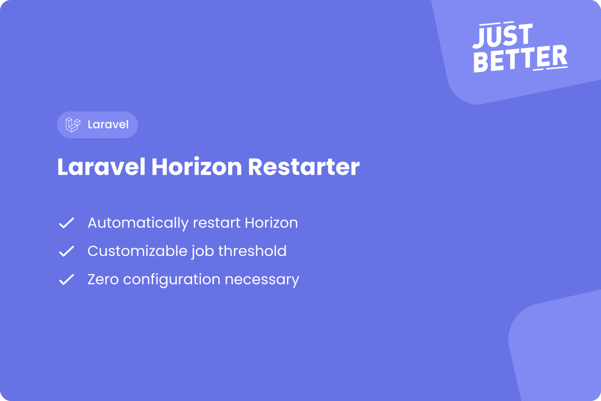

<a href="https://github.com/justbetter/laravel-horizon-restarter" title="Horizon Restarter">
    
</a>

# Laravel Horizon Restarter

<p>
    <a href="https://github.com/justbetter/laravel-horizon-restarter"></a>
    <a href="https://github.com/justbetter/laravel-horizon-restarter"></a>
    <a href="https://github.com/justbetter/laravel-horizon-restarter"></a>
    <a href="https://github.com/justbetter/laravel-horizon-restarter"></a>
</p>

Automatically restart Horizon after a given amount of jobs.

## Why?

PHP is not designed for long running processes, it can sometimes run into issues when it has been running for too long.
Horizon workers can automatically be stopped after processing a configured amount of jobs (maxjobs). However, depending on the balanceMaxShift and balanceCooldown, it may take a while before all processes are running again.
This package will automatically restart Horizon gracefully after a given amount of jobs have been processed.

This package is to simplify configuration and to ensure that Horizon is restarted automatically.

## Installation

You can install the package via composer:

```bash
composer require justbetter/laravel-horizon-restarter
```

## Configuration

By default, after 100.000 jobs have been processed, Horizon will be terminated.
This can be configured by adding the following to your `.env` file:

```
HORIZON_RESTARTER_THRESHOLD=100000
```

## Quality

To ensure the quality of this package, run the following command:

```shell
composer quality
```

This will execute three tasks:

1. Makes sure all tests are passed
2. Checks for any issues using static code analysis
3. Checks if the code is correctly formatted

## Contributing

Please see [CONTRIBUTING](.github/CONTRIBUTING.md) for details.

## Security Vulnerabilities

Please review [our security policy](../../security/policy) on how to report security vulnerabilities.

## Credits

- [Ramon Rietdijk](https://github.com/ramonrietdijk)
- [All Contributors](../../contributors)

## License

The MIT License (MIT). Please see [License File](LICENSE) for more information.

<a href="https://justbetter.nl" title="JustBetter">
    
</a>
